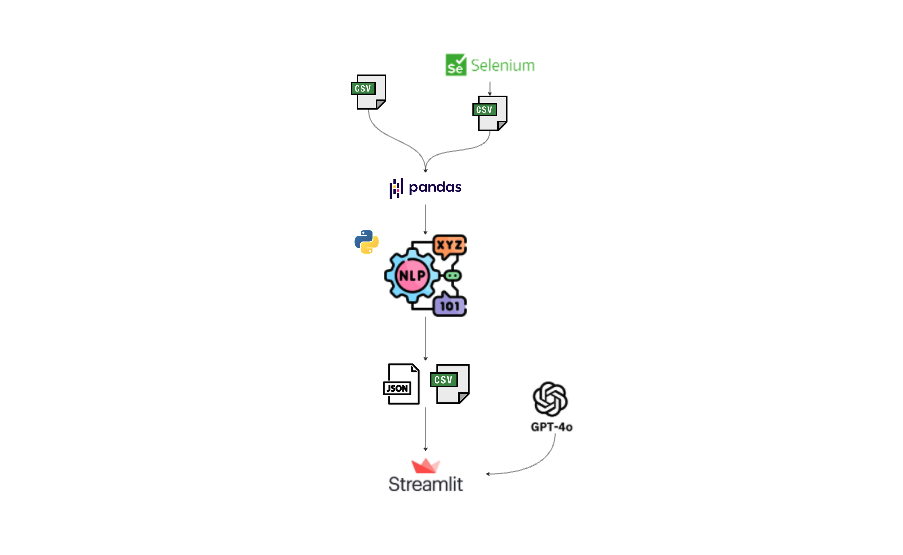

# 📊 Trust Pilot Reviews – Architecture Microservices MLOps

## 📖 Présentation du Projet

Ce projet vise à fournir une solution simple et économique permettant aux petites boutiques en ligne et aux startups d’analyser les avis clients.

L’objectif principal est d’extraire des informations pertinentes à partir des retours clients afin d’aider ces entreprises à améliorer leurs produits et services.  

Grâce à des outils Python et au Machine Learning, le projet permet de classifier le sentiment des clients (positif, neutre, négatif) et de présenter ces résultats dans un tableau de bord clair et interactif avec Streamlit.

---

## 🎯 Problématique

Les petites entreprises commerciales manquent souvent de ressources pour réaliser une analyse approfondie des avis clients.

Comprendre la satisfaction client à travers les avis est pourtant essentiel pour améliorer les produits et services.

Ce projet répond à ce besoin en proposant une solution accessible, scalable et automatisée, permettant d’analyser efficacement les sentiments sans nécessiter d’outils coûteux ou de compétences techniques avancées.

---

## 🧠 Technologies Utilisées

- **Selenium** : scraping des avis Google Maps  
- **CSV / Google Drive** : stockage des données  
- **Pandas** : nettoyage et traitement des données  
- **Scikit-learn** : modèle de classification des sentiments  
- **Streamlit** : visualisation interactive  
- **FastAPI**
- **Docker**
- **Docker Compose**
- **MLflow**
- **Apache Airflow**
- **Pytest**
- **GitHub Actions**
- **NLTK**
- **Gensim (LDA)**

---



---

# 🏗️ Architecture Globale

## 🔁 Flux du Pipeline


Scraper → Cleaning → ML (Sentiment + Topics)
↓
MLflow
↓
Airflow


---

## 🧩 Vue des Microservices

### 1️⃣ Service Scraper
- Collecte des avis Google Maps
- Basé sur Selenium
- Expose une API FastAPI

### 2️⃣ Service Cleaning
- Nettoyage et structuration des données
- Utilise Pandas
- Sauvegarde des fichiers CSV traités

### 3️⃣ Service ML
- Réalise :
  - Analyse de sentiment
  - Topic Modeling (LDA)
- Enregistre les expériences dans MLflow

### 4️⃣ MLflow
Permet de suivre :
- Accuracy
- Paramètres
- Artifacts
- Topics

### 5️⃣ Airflow
Orchestre :
- `run_scraper`
- `run_cleaning`
- `run_ml`

---

# 📂 Structure du Projet


trust-pilot-reviews/
│
├── services/
│ ├── scraper/
│ ├── cleaning/
│ └── ml/
│
├── src/
│ ├── scraper.py
│ ├── run_cleaning.py
│ ├── sentiment.py
│
├── airflow/
│ └── dags/pipeline_dag.py
│
├── tests/
│
├── docker-compose.yml
├── README.md
└── .github/workflows/ci.yml


Tous les services :

- Possèdent leur propre Dockerfile  
- Ont des dépendances isolées  
- Partagent les données via des volumes Docker  

Dossiers partagés :


data/
├── raw/
└── processed/


---

# 🐳 Lancement du Projet

## 🔹 Construction et démarrage des services

```bash
docker compose up --build
```

🌐 Endpoints des Services
Service	URL
Scraper	http://localhost:8001

Cleaning	http://localhost:8002

ML	http://localhost:8003

MLflow	http://localhost:5000

Airflow	http://localhost:8080

🧹 Service Scraper
Endpoint : POST /scrape
Body de la requête
{
  "url": "https://www.google.com/maps/place/Caf%C3%A9+de+Flore/@48.8541623,2.3300297,16z/data=!4m8!3m7!1s0x47e671d781fb9dab:0x18bba6dd45e173ff!8m2!3d48.8541588!4d2.3326046!9m1!1b1!16zL20vMDhkeXY4?entry=ttu&g_ep=EgoyMDI2MDIyMy4wIKXMDSoASAFQAw%3D%3D",
  "name": "cafe_de_flore",
  "max_reviews": 100
}
🧼 Service Cleaning
Endpoint
POST /clean
Body de la requête
{
  "name": "cafe_de_flore",
  "plot": false
}
🤖 Service ML
Endpoint
POST /sentiment

Ce service réalise :

Analyse de sentiment

Topic Modeling (LDA)

Enregistrement des métriques dans MLflow

📊 MLflow

Accès :

http://localhost:5000

Suivi disponible :

Expériences

Runs

Métriques

Paramètres

Artifacts

🔄 Orchestration avec Airflow

Accès :

http://localhost:8080

Identifiants par défaut :

Username : admin

Password : admin

Nom du DAG :

microservices_pipeline

Flux d’exécution :

run_scraper → run_cleaning → run_ml

Déclenchement manuel :

Ouvrir l’interface Airflow

Activer le DAG

Cliquer sur "Trigger DAG"

Airflow appelle automatiquement chaque microservice FastAPI.

🧪 Exécution des Tests

Installation des dépendances :

pip install -r requirements-dev.txt

Lancement des tests :

pytest

Les tests couvrent :

Validation des entrées

Vérification des statuts HTTP

Comportement basique des API

⚙️ CI – GitHub Actions

À chaque push sur main :

Environnement Python créé automatiquement

Installation des dépendances

Exécution automatique des tests

Fichier workflow :

.github/workflows/ci.yml

Si les tests échouent → ❌ Build échoue
Si les tests réussissent → ✅ Build validé

🗂️ Flux des Données
Avis Google Maps
        ↓
Données brutes (data/raw/)
        ↓
CSV nettoyés (data/processed/)
        ↓
Sentiment + Topics
        ↓
Suivi via MLflow
🏆 Points Forts du Projet

Architecture microservices

Pipeline ML de bout en bout

Suivi des expériences avec MLflow

Orchestration avec Airflow

Système entièrement containerisé

Intégration Continue avec tests automatisés

📌 Améliorations Futures


- Déploiement cloud (AWS / Azure)
ajouter plus de metrique de controle de modeles, avec un seuil doutliers  a definir 

- Push automatique des images Docker en CI

- Rapport de couverture des tests

- Monitoring (Prometheus)