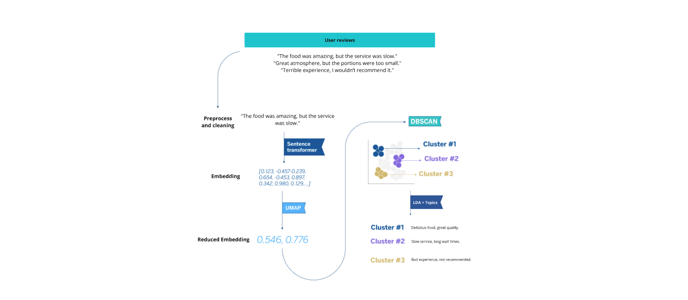

# 📊 Trust Pilot Reviews – MLOps Microservices Architecture

## 🚀 Overview

This project aims to provide a simple, cost-effective solution for small online stores and startups to analyze customer reviews. The main goal is to extract insights from customer feedback that will help these businesses improve their products and services. By using Python tools and machine learning, this project helps to classify customer sentiment (positive, neutral, negative) and presents these insights in an easy-to-read dashboard using Streamlit.

 **microservices architecture powered by Docker**.

## Problem Statement
Small commerce businesses often lack the resources to conduct in-depth analysis of customer reviews. Understanding customer satisfaction through reviews can be crucial for product and service improvements. This project addresses this need by delivering a solution that is both accessible and scalable, allowing small businesses to efficiently analyze customer sentiment without the need for extensive technical knowledge or expensive tools.

## Technologies
- **Selenium**: Used for scraping customer reviews from online stores.
- **CSV/Google Drive**: Data storage in CSV format, either locally or in Google Drive.
- **pandas**: Used for cleaning and processing the text data.
- **scikit-learn**: Implements a simple machine learning model for sentiment analysis.
- **streamlit**: Displays the results in an accessible and interactive dashboard.

## Project Phases
1. **Data Collection (raw and with Scraping)**: Reviews will be collected from online stores using Python's Scrapy framework and stored in CSV format.
2. **Data Cleaning**: The raw data will be saved in CSV files locally or in Google Drive.
3. **Sentiment Analysis**: The data will be processed using pandas to clean and prepare it for machine learning analysis.  A machine learning model, implemented in scikit-learn, will classify reviews as positive, neutral, or negative.
4. **Data Visualization**: The results of the analysis will be displayed with a streamlit app for easy interpretation and insights.


The pipeline includes:

1. **Scraper Service** – Collects reviews from Google Maps  
2. **Cleaning Service** – Cleans and structures raw data  
3. **ML Sentiment Service** – Performs NLP, embeddings, clustering & topic modeling  
4. **API Service (FastAPI)** – Exposes the pipeline via HTTP  
5. **Streamlit Service** – Provides an interactive dashboard  




This architecture follows modern **MLOps principles**:

- Containerized services  
- Isolated dependencies  
- Reproducible environments  
- Volume-based data exchange  
- Service modularity  
- Ready for orchestration (Docker Compose / Kubernetes)  

---

# 🏗 Architecture Overview

               ┌─────────────────┐
               │   Scraper       │
               │  (Selenium)     │
               └────────┬────────┘
                        │
                        ▼
                data/raw/*.csv
                        │
                        ▼
               ┌─────────────────┐
               │   Cleaning      │
               │  (Pandas)       │
               └────────┬────────┘
                        │
                        ▼
             data/processed/*_reviews.csv
                        │
                        ▼
               ┌─────────────────┐
               │  ML Sentiment   │
               │ (NLP + ML)      │
               └────────┬────────┘
                        │
                        ▼
    *_ml_processed_reviews.csv
    *_sample_selected_reviews.csv
                        │
                        ▼
               ┌─────────────────┐
               │  Streamlit App  │
               └─────────────────┘


All services share a mounted Docker volume:

```bash
-v ${PWD}/data:/app/data

TRUST-PILOT-REVIEWS/
│
├── services/
│   ├── scraper/        # Selenium scraping service
│   ├── cleaning/       # Data preprocessing service
│   ├── ml/             # Sentiment + NLP service
│   ├── api/            # FastAPI service
│   ├── streamlit/      # Dashboard
│   └── docker-compose.yml
│
├── src/                # Core business logic
│
├── data/
│   ├── raw/
│   └── processed/
 
```
Each service has:

Its own Dockerfile

Its own requirements.txt

Isolated dependency scope


                ┌────────────┐
Client ───────► │   API      │
                └─────┬──────┘
                      │
     ┌────────────────┼────────────────┐
     ▼                ▼                ▼
 Scraper API     Cleaning API     ML API


 # 🍽️ MLOps Restaurant Reviews Pipeline

Ce projet est une architecture microservices permettant de :

1. Scraper des avis Google Maps
2. Nettoyer les données
3. Appliquer un pipeline ML (sentiment, embeddings, clustering, topics)

Architecture :

Scraper → Cleaning → ML (Sentiment & Topics)

Tous les services sont dockerisés et orchestrés avec Docker Compose.

---

# 📦 Architecture

services/
├── scraper/
├── cleaning/
├── ml/
src/
├── scraper.py
├── run_cleaning.py
├── sentiment.py
data/
├── raw/
├── processed/

Les dossiers `data/raw` et `data/processed` sont partagés entre services via volumes Docker.

---

# 🚀 Lancement global

```bash
docker compose up --build


Airflow
   ↓
Scraper container
   ↓
Cleaning container
   ↓
ML container (run_sentiment)
   ↓
MLflow


scraper (8001)
cleaning (8002)
ml (8003)
mlflow (5000)
airflow (8080)


# 🚀 Trust Pilot Reviews – Microservices ML Pipeline

## 📖 Project Overview

This project is a complete microservices-based data pipeline that:

1. Scrapes Google Maps reviews
2. Cleans and preprocesses text data
3. Applies Machine Learning:
   - Sentiment Analysis
   - Topic Modeling (LDA)
4. Tracks experiments with MLflow
5. Orchestrates the pipeline with Airflow
6. Includes CI with GitHub Actions

The system is fully containerized using Docker and orchestrated with Docker Compose.

---

# 🏗️ Architecture


Scraper → Cleaning → ML (Sentiment + Topics)
↓
MLflow (Experiment Tracking)
↓
Airflow (Pipeline Orchestration)


---

# 📂 Project Structure


trust-pilot-reviews/
│
├── services/
│ ├── scraper/
│ ├── cleaning/
│ └── ml/
│
├── src/
│ ├── scraper.py
│ ├── run_cleaning.py
│ ├── sentiment.py
│
├── airflow/
│ └── dags/pipeline_dag.py
│
├── tests/
│
├── docker-compose.yml
├── README.md
└── .github/workflows/ci.yml


---

# 🐳 Running the Project (Docker)

## 🔹 1️⃣ Build and start all services

```bash
docker compose up --build
🌐 Service Endpoints
Service	URL
Scraper	http://localhost:8001

Cleaning	http://localhost:8002

ML	http://localhost:8003

MLflow	http://localhost:5000

Airflow	http://localhost:8080
🧹 Scraper Service
Endpoint
POST /scrape
Example Request
{
  "url": "https://google-maps-url",
  "name": "restaurant_name",
  "max_reviews": 100
}
Example using curl
curl -X POST http://localhost:8001/scrape \
-H "Content-Type: application/json" \
-d '{
  "url": "https://google-maps-url",
  "name": "cafe_de_flore",
  "max_reviews": 50
}'
🧼 Cleaning Service
Endpoint
POST /clean
Body
{
  "name": "cafe_de_flore"
}
🤖 ML Service
Endpoint
POST /sentiment
Body
{
  "name": "cafe_de_flore",
  "plot": false
}

This performs:

Sentiment Analysis

Topic Modeling (LDA)

Logs metrics into MLflow

📊 MLflow
Access
http://localhost:5000
What You Can See

Experiments

Runs

Metrics

Parameters

Artifacts

Example logged:

Sentiment accuracy

Topic keywords

🔄 Airflow Orchestration
Access
http://localhost:8080

Default credentials:

Username: admin
Password: admin
DAG Name
microservices_pipeline
Execution Flow
run_scraper → run_cleaning → run_ml

To trigger manually:

Go to Airflow UI

Activate DAG

Click "Trigger DAG"

Airflow calls each FastAPI microservice automatically.

🧪 Running Tests

Install dev dependencies:

pip install -r requirements-dev.txt

Run tests:

pytest

Tests include:

Input validation

Endpoint response status

Basic API behavior

⚙️ CI – GitHub Actions

On every push to main:

Python environment is created

Dependencies installed

Tests executed automatically

Workflow file:

.github/workflows/ci.yml

If tests fail → Build fails ❌
If tests pass → Build succeeds ✅

🧠 Technologies Used

FastAPI

Docker

Docker Compose

MLflow

Apache Airflow

Pytest

GitHub Actions

NLTK

Gensim (LDA)

Scikit-learn

🗂️ Data Flow
Google Maps Reviews
↓
Raw JSON (data/raw/)
↓
Cleaned CSV (data/processed/)
↓
Sentiment + Topics
↓
MLflow Tracking
🎯 How to Run Entire Pipeline (Full Demo)

Start services

docker compose up --build

Go to Airflow
→ Trigger microservices_pipeline

Monitor logs in Airflow

View experiment results in MLflow

🏆 Project Highlights

✔ Microservices architecture
✔ End-to-end ML pipeline
✔ Experiment tracking
✔ Workflow orchestration
✔ Containerized system
✔ CI with automated tests

📌 Future Improvements

Add Streamlit dashboard

Deploy on cloud (AWS / Azure)

Add Docker image push in CI

Add coverage report

Add monitoring (Prometheus)